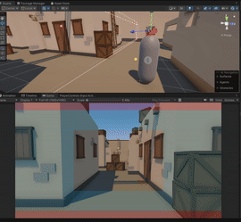
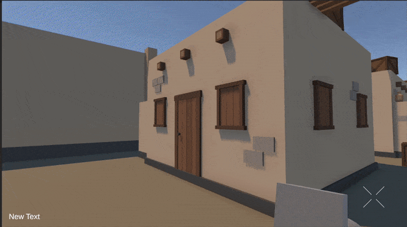
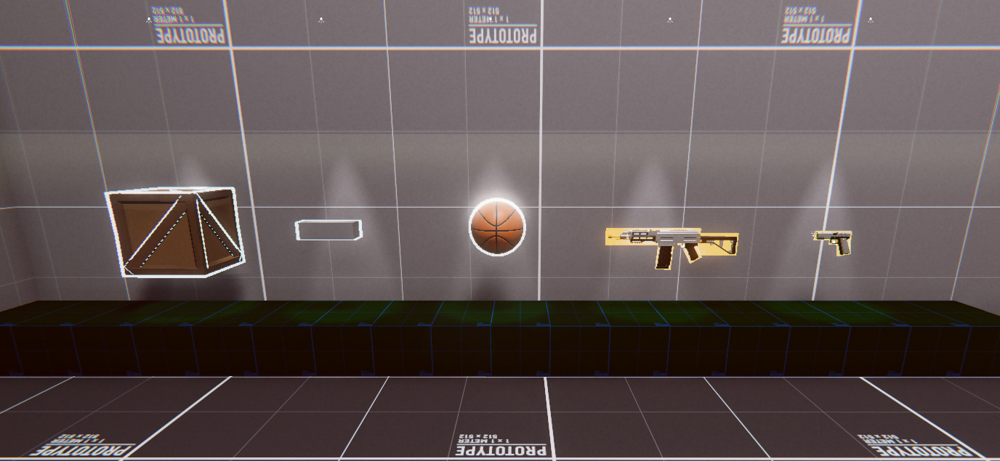
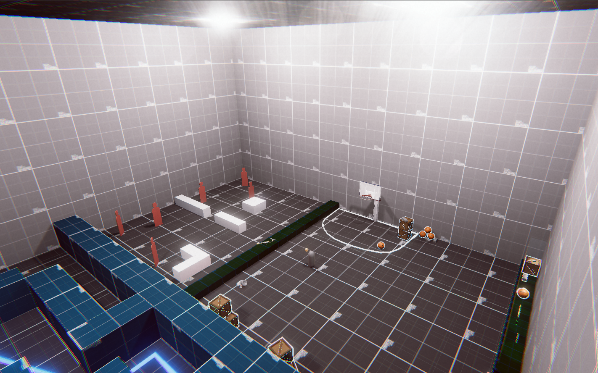

# Prueba Técnica - Waylabs
A continuación les presento la documentación de este pequeño proyecto, donde está explicado punto por punto los requerimientos de la prueba, el cómo se implementó y que decisiones creativas tomé al interpretar los mismos.

### 0 - Base del juego
### 1 - Objetos básicos
### 2 - Armas
### 3 - Munición
### 4 - Inventario
### 5 - Escenas
### 6 - Enemigos 
### 7 - Feedback
### 8 - UI
### 9 - Añadidos
##

## Base del juego
#### Movimiento
Decidí tomar la ruta del movimiento basádo en físicas ya que sabía que más adelante iba a implementar varios objetos con los que se comportarían con físicas y quería que estos objetos, fueran los protagonistas principales de la Demo.
Implementé el new Input System de Unity. Se puede mover con **WASD** ``` PlayerMovement.Move() ``` y **SHIFT** para correr ``` PlayerMovement.OnSprint(InputAction.CallbackContext context) ```

#### Cámara
Implementé un sistema diferente a las cámaras en primera persona convencionales, ya que quería darle cierta ambietación al estilo de [BODYCAM](https://youtu.be/bL-TWFgJpIw?si=2v-roGyF3kvR0L8v) o [Puck](https://youtu.be/GA2iLu3Heek?si=a4x7oO9h05XwOIEO), pero siendo más arcade.
Se aprovecha de algunas funcionalidades adicionales del paquete para Unity [Cinemachine](https://unity.com/features/cinemachine), creando una zona "Libre" donde el punto de mira se puede mover libremente, pero cuando el cursor llega a unos límites establecidos, empieza a girar lentamente la cámara, entre más se salga del límite, más rápido va a girar la cámara.



Para crear el punto de mira se usa el valo de la **posición del Mouse** para ubicar un **Crosshair**, este se usa para poder interactuar con los objetos por medio de un ``` Raycast ``` desde la cámara hasta la posición del mundo donde se encuentra apuntando el cursor. A lo que nos lleva a el siguiente punto.


## Objetos Básicos
#### Recoger y soltar objetos
Los objetos se recogen pulsando la **Tecla E** cuando están señalados por un delineado, antes de que pase esto, se debe apuntar con el **Crosshair** encima del objeto. Una vez tengas un objeto equipado en tu mano puedes presionar una vez a la **Tecla Q** para soltar el objeto, sin embago si en vez de darle un solo toque, la manteienes presionada, el objeto será lanzado con una fuerza que depende del peso del objeto y el tiempo que la presiones.



Hay 5 objetos de los cuales se puede interactuar, los 3 primeros son la caja de madera, el ladrillo y la pelota de baloncesto, estos 3 reaccionan de manera diferente a las físicas debido a sus diferntes propiedades como la masa, la fricción y su elastícidad.



> [!TIP]
> ¡Puedes lanzar objetos contra los enemigos! el daño dependerá del peso y la velocidad con la que se lance el objeto

## Armas
Tu **Crosshair** cambiará para poder operarlas con precisión. Tenemos 2 armas, **la pistola Semi-Automática**, solo se dispara una vez al presionarse el **Click Izquierdo**. También hay un **Rifle de asalto automático**, disparará mientras se mantenga pulsado el **Click Izquierdo**.
Si nos quedamos sin munición en el cargador actual, hay que presionar la **Tecla R** para recargarla, la pistsola tomará menos tiempo que el Rifle de Asalto.
Cuando aparezca un **Núcleo de enegría** (Objeto que ilumina rojo) Podremos tocarlo con un arma para mejorarla y así disparar municiones laser, las cuales hacen más daño e impactan instantaneamente al objetivo.


## Inventario
Te permite almacenar objetos que hay en el entorno, puedes tener **hasta 5 de ellos en un solo espacio** _(Las armas no se pueden acumular)_, para poder cambiar los Objetos que tengas guardados en el inventario, debes subir o bajar con la **Rueda del Mouse**. 


## Escenas
#### Entrenamiento / Entretenimiento
En esta primera zona podrás probar todos los objetos disponibles en el juego, no sin antes pasar por un pequeño tutorial que te enseñará **cómo usar la nueva cámara**, haciendote pasar por un laberinto; **Cómo recoger y lanzar los objetos**, con los cuales podrás jugar un rato dentro de la escena; y finalmente el **Cómo usar las armas**, tu principal medio de defensa.


