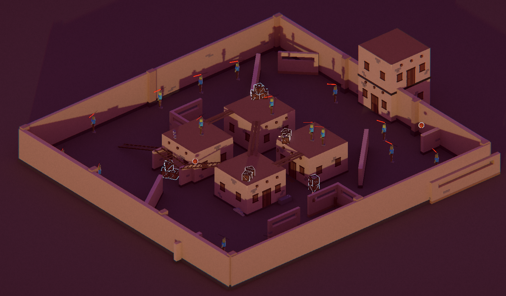
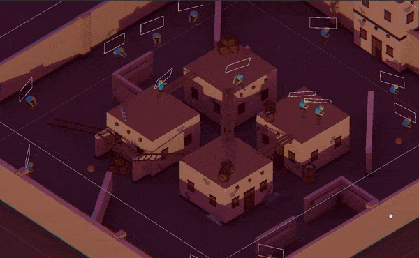

# Prueba Técnica - Waylabs
### [¡Descarga el prototipo aquí!](https://github.com/Adept-KeyCap/Waylabs_Test/releases/tag/Prototype)

**Documentación del proyecto:** Aquí encontrará explicado punto por punto los requerimientos de la prueba, el cómo se implementó y que decisiones creativas tomé al interpretar los mismos.

 0. [Base del juego](#base-del-juego)
 1. [Objetos básicos](#objetos-básicos)
 2. [Armas](#armas)
 3. [Inventario](#inventario)
 4. [Escenas](#escenas)
 5. [Enemigos](#enemigos) 
 6. [Feedback](#feedback)
 7. [UI](#ui)
 8. [Notas finales](#notas-finales)
##

## Base del juego
#### Movimiento
Decidí tomar la ruta del movimiento basádo en físicas ya que sabía que más adelante iba a implementar varios objetos con los que se comportarían con físicas y quería que estos objetos, fueran los protagonistas principales de la Demo.
Implementé el new Input System de Unity. Se puede mover con **WASD** ``` PlayerMovement.Move() ``` y **SHIFT** para correr ``` PlayerMovement.OnSprint(InputAction.CallbackContext context) ``` - [PlayerMovemenvt.cs](https://github.com/Adept-KeyCap/Waylabs_Test/blob/main/TechnicalTest/Assets/1-Scripts/Player/PlayerMovement.cs)

#### Cámara
Implementé un sistema diferente a las cámaras en primera persona convencionales, ya que quería darle cierta ambietación al estilo de [BODYCAM](https://youtu.be/bL-TWFgJpIw?si=2v-roGyF3kvR0L8v) o [Puck](https://youtu.be/GA2iLu3Heek?si=a4x7oO9h05XwOIEO), pero siendo más arcade.

Se aprovecha de algunas funcionalidades adicionales del paquete para Unity [Cinemachine](https://unity.com/features/cinemachine), creando una zona "Libre" donde el punto de mira se puede mover libremente, pero cuando el cursor llega a unos límites establecidos, empieza a girar lentamente la cámara, entre más se salga del límite, más rápido va a girar la cámara.

Esto se logra usando una ```CinemachineVirtualCamera``` un componente el cual no está hecho para juegos 3D, solo para el apartado 2D, pero resulta que esta cámara también tiene una propiedad llamada ```CinemachineVirtualCamera.Body``` el cual es responsable de establecer diferentes algoritmos para controlar el cómo se mueve la cámara, en este caso, hay uno que se llama **[Body.Hard Lock to Target](https://docs.unity3d.com/Packages/com.unity.cinemachine@2.2/manual/CinemachineBodyHardLockTarget.html)**, el cual indica que se va a usar la propiedad ```Follow``` como una montura para la cámara, lo cual hace que la ```CinemachineVirtualCamera``` *(Que no rota por ser usada para juegos 2D)* tenga que ajustarse a cualquier trasnformación para poder mantener su objetivo dentro de la vista de la cámara, y por estar literalmente pegada a la cabeza del jugador, esta se ve obligada a rotar, así después ajustando nuestro jugador a la rotaciónd de la cámara misma.


[**AimController.cs**](https://github.com/Adept-KeyCap/Waylabs_Test/blob/main/TechnicalTest/Assets/1-Scripts/Player/AimController.cs)
Esta función modifica la posición de un objeto vacío, el cual será el ```CinemachineVirtualCamera.Target```, este objeto tiene que mantenerse a una distancia constante de la cámara y este debe rotar alrededor de ella. implementar este método es necesario debido a que el game object debe seguir el cambio de la posición del mosue en la pantalla, por lo que es necesario convertir las coordenadas de esta manera.
```C#
private void RotateAim(Transform aimObj, Vector2 aimDelta, float radius, float sensitivity)
{
    // Convert mouse movement to angles
    float yaw = aimDelta.x * sensitivity; // Horizontal movement (Y-axis in 3D space)
    float pitch = -aimDelta.y * sensitivity; // Vertical movement (X-axis in 3D space)

    // Get the current direction of AimObj relative to the player
    Vector3 direction = (aimObj.position - transform.position).normalized;

    // Apply rotation on both axes
    Quaternion yawRotation = Quaternion.AngleAxis(yaw, Vector3.up); // Rotation around the Y-axis
    Quaternion pitchRotation = Quaternion.AngleAxis(pitch, transform.right); // Rotation around the X-axis

    // Combine both rotations
    direction = yawRotation * pitchRotation * direction;

    // Maintain a constant distance from the player
    aimObj.position = transform.position + direction * radius;
} 

```

Para crear el punto de mira se usa el valo de la **Posición del Mouse** para ubicar un **Crosshair**, este se usa para poder interactuar con los objetos por medio de un ```Raycast``` desde la cámara hasta la posición del mundo donde se encuentra apuntando el cursor. A lo que nos lleva a el siguiente punto.


## Objetos Básicos
#### Recoger y soltar objetos
Los objetos se recogen pulsando la **Tecla E** cuando están señalados por un delineado, antes de que pase esto, se debe apuntar con el **Crosshair** encima del objeto. Una vez tengas un objeto equipado en tu mano puedes presionar una vez a la **Tecla Q** para soltar el objeto, sin embago si en vez de darle un solo toque, la manteienes presionada, el objeto será lanzado con una fuerza que depende del peso del objeto y el tiempo que la presiones.


[**ItemOnHand_Controller.cs**](https://github.com/Adept-KeyCap/Waylabs_Test/blob/main/TechnicalTest/Assets/1-Scripts/Items/Grabbable/ItemOnHand_Controller.cs)
Esta función es la principal responsable por la lógica de cómo se agarran y se encanrga de avisarle al Inventario de que objeto va a almacenar
```C#
public void GrabItem() 
{
    // Tell the item to attach to the player's hand when picking it up and add it to the inventory
    // Or activate the Item stored in the inventory to equip in hand
    if (grabbable && hitObject != null)
    {
        grabbable = false;
        hitObject.Grabbed(grabPoint); // Attach item to grab point

        
        bool added = invManager.AddObject(hitObject.inventoryObject, hitObject.gameObject); // Store the item in inventory

        if (!added)
        {
            // Inventory full, cannot pick up more items
            return;
        }

        
        if (held_Item == null) // If nothing is in hand, equip this item immediately
        {
            EquipItem(hitObject.gameObject);
        }
        else
        {
            hitObject.gameObject.SetActive(false); // If an item is already held, just store it (disable the new item)
        }
    }
}

```

Hay 5 objetos de los cuales se puede interactuar, los 3 primeros son la caja de madera, el ladrillo y la pelota de baloncesto, estos 3 reaccionan de manera diferente a las físicas debido a sus diferntes propiedades como la masa, la fricción y su elastícidad.


> [!TIP]
> ¡Puedes lanzar objetos contra los enemigos! el daño dependerá del peso y la velocidad con la que se lance el objeto:

[**Item.cs**](https://github.com/Adept-KeyCap/Waylabs_Test/blob/main/TechnicalTest/Assets/1-Scripts/Items/Grabbable/Item.cs)
```C#
private void OnCollisionEnter(Collision collision)
{
    if(audioSource.clip != contactAudio) // if the GameObject collides with anything, it will play a sound
    {
        audioSource.clip = contactAudio;
    }
    audioSource.Play();

    // is the GameObject velocity is greater than a threshold and collides, deal damage to a Enemy part
    if(collision.gameObject.GetComponent<DamageHandler>() != null && rb.velocity.magnitude >= 2) 
    {
        DamageHandler handler = collision.gameObject.GetComponent<DamageHandler>();
        float damage = rb.velocity.magnitude * (rb.mass * 75);
        handler.OnHit(Vector3.zero, damage, Vector3.forward);
    }
}
```

## Armas
Tu **Crosshair** cambiará para poder operarlas con precisión. Tenemos 2 armas, **la pistola Semi-Automática**, solo se dispara una vez al presionarse el **Click Izquierdo**. También hay un **Rifle de asalto automático**, disparará mientras se mantenga pulsado el **Click Izquierdo**.
Si nos quedamos sin munición en el cargador actual, hay que presionar la **Tecla R** para recargarla, la pistsola tomará menos tiempo que el Rifle de Asalto.
Cuando aparezca un **Núcleo de enegría** (Objeto que ilumina rojo) Podremos tocarlo con un arma para mejorarla y así disparar municiones laser, las cuales hacen más daño e impactan instantaneamente al objetivo.


[**Weapon.cs**](https://github.com/Adept-KeyCap/Waylabs_Test/blob/main/TechnicalTest/Assets/1-Scripts/Items/Weapons/Weapon.cs)
La siguente extensa función, lo que nos permite es realizar ciertas acciones a la hora de disparar, dependiendod el tipo de munición que tenga equipada el arma, así podemos cambiar la lógica entre la creación de proyectiles físicos, y la munición laser que es un raycast, haciendo la configuración de las armas algo bastante odular ne caso de que tipo de arma queremos, con ciertas estadísticas.
```C#
private void Fire() // If the weapon have available ammo, shoot and refresh the ammo display 
{
    if (!canFire ) //checks for fire timing (Semi-Automatic Fire)
    {
        return;
    }
    else if(currentAmmo <= 0)
    {
        weaponSoundManager.Play_FireEmpty();
        return;
    }

    // Reduce ammo and refresh display
    currentAmmo = Mathf.Clamp(currentAmmo - 1, 0, maxAmmo);
    ammoTxt.text = $"{currentAmmo} | {maxAmmo}";

    Quaternion rotation;

    // Raycast to check if the shot hits anything
    if (Physics.Raycast(new Ray(firePoint.position, rayDirection), out RaycastHit hit, 500, mask))
    {
        rotation = Quaternion.LookRotation(hit.point - firePoint.position); // Aim at the hit point
    }
    else
    {
        rotation = Quaternion.LookRotation(rayDirection); // No hit, then Shoot straight
    }

    if (!laser)  // Checks if this weapon has laser ammo enabled
    {
        // Shot feedback
        weaponSoundManager.Play_Fire();
        bulletParticles.Play();
        castingParticles.Play();

        // Create and launch the projectile
        GameObject projectile = Instantiate(prefabProjectile, firePoint.position, rotation);
        Debug.Log(projectile.name + " Fired");
        projectile.GetComponent<Bullet>().GetWeaponStat(projectileSpeed, projectileSpeed/2);
        projectile.GetComponent<Rigidbody>().velocity = projectile.transform.forward * projectileSpeed;
    }
    else 
    {    
        // Laser shot feedback
        weaponSoundManager.Play_Laser();
        laserParticles.Play();

        lineRenderer.enabled = true;
        lineRenderer.SetPosition(0, firePoint.position);
        lineRenderer.SetPosition(1, positionCrosshair.position);
        StartCoroutine(ClearLaser(0.3f));

        if (hit.collider.gameObject.GetComponent<IHittable>() != null)
        {
            hit.collider.gameObject.GetComponent<IHittable>().OnHit(Vector3.zero, projectileSpeed * 1.5f, Vector3.zero);
            lineRenderer.SetPosition(1, hit.point);
        }
    }

    if (!automatic) // If semi-auto, prevent firing again until cooldown
    {
        canFire = false;
        Invoke(nameof(ResetFire), fireRate);
    }
}
```

## Inventario
Te permite almacenar objetos que hay en el entorno, puedes tener **hasta 5 de ellos en un solo espacio** _(Las armas no se pueden acumular)_, para poder cambiar los Objetos que tengas guardados en el inventario, debes subir o bajar con la **Rueda del Mouse**. 


El inventario está compuesto por 4 clases principales, el **InventoryManager, InventorySlot, InventoryItem e InventoryObject**. Cada uno maneja una capa de profundidad, hay cierto número limitado de **Slots** donde se instancian **InventoryItems** los cuales son las visuales dentro de la interfaz, por medio de un _ScriptableObjects_ se encargan de pre-cargar os atributos del objeto, cómo el ícono que llevará en el inventario **o si es acumulable o no**.

[**InventoryManager.cs**](https://github.com/Adept-KeyCap/Waylabs_Test/blob/main/TechnicalTest/Assets/1-Scripts/Inventory/InventoryManager.cs)
Este método es el más relevante dentro del inventario ya que se encarga de añadir los objetos al inventario. Primero verifica que haya algún **Slot** disponible para almacenar el objeto que se acaba de agarrar; procede a veirificar los datos del objeto para saber si este puede ser acumulado junto a otros o no.
```C#
// When picking up an Item, check if there any space and assign it to the first empty slot found
public bool AddObject(InventoryObject invObject, GameObject realObj)
{
    // 1. Check if an existing stackable item exists
    foreach (var slot in inventorySlots)
    {
        InventoryItem objInSlot = slot.GetComponentInChildren<InventoryItem>();

        if (objInSlot != null && objInSlot.inventoryObject == invObject && objInSlot.count < 5 && invObject.stackable)
        {
            objInSlot.count++;
            objInSlot.RefreshCount();
            realObj.SetActive(false); // Hide the object when stored

            return true;
        }
    }

    // 2. If no stackable slot found, place in an empty slot
    foreach (var slot in inventorySlots)
    {
        if (slot.storedGameObject == null)
        {
            slot.storedGameObject = realObj;
            realObj.SetActive(false); // Hide the object when stored

            // New UI item for the inventory
            SpawnNewObject(invObject, slot);
            return true;
        }
    }

    return false; // Inventory full
}
```

> [!WARNING]
> Lamentablemente no logré solucionar un error el cual al lanzar un objeto que está acumulado junto a otros, también saca al resto del inventario. Esto es debido a equivocarme al empezar a programar y haber creado tanto los objetos interactuables como el sistema del inventario de maneras muy aisladas. **Por lo que una oportunidad de mejora sería el reestructurar estos 2 sistemas de una manera más modular**.

## Escenas
#### Entrenamiento / Entretenimiento
En esta primera zona podrás probar todos los objetos disponibles en el juego, no sin antes pasar por un pequeño tutorial que te enseñará **cómo usar la nueva cámara**, haciendote pasar por un laberinto; **Cómo recoger y lanzar los objetos**, con los cuales podrás jugar un rato dentro de la escena; y finalmente el **Cómo usar las armas**, tu principal medio de defensa.


#### Zona de la misión
En este mapa encontraras a los enemigos esperandote, tu misión es eliminarlos a todos para limpiar el pueblo, encontrarás los 5 objetos principales por todos lados, solo una pistola que aparecerá cerca tuyo, y un rifle que tendrás que buscar, también al paso del tiempo, aparecerá un **Núcleo de energía** en alguna zona aleatoria, con el cual mejorarás tu arma para eliminar a los enemigos más fácilmente, está atento al entorno. 



## Enemigos
#### Comportamiento básico
Empezamos por la parte del seguimiento, donde implementé el paquete de Unity [AI Navigation](https://docs.unity3d.com/Packages/com.unity.ai.navigation@2.0/manual/index.html), con el cual se puede generar fácilmente un terreno donde el **Agente** puede caminar dependiendo de ciertas condiciones o caracteristicas del **Agente** y el terreno, más conocido como **NavMesh**. 




#### Máquina de estados
El enemigo está compuesto por la famosa estructura de al máquina de estados, la cuan permite que el enemigo reaccione bajo ciertas situaciones y cambie su comportamiento acorde a esto. En este caso tenemos una bastante simple donde el enemigo tiene 4 estados. La principal función que aprovecho de este compoente es la falcilidad de cambiar las animaciones dependiendo de las situaciones.

[**EnemyStateMachine.cs**](https://github.com/Adept-KeyCap/Waylabs_Test/blob/main/TechnicalTest/Assets/1-Scripts/Enemy/EnemyStateMachine.cs)
```C#
void FixedUpdate()
{
    float targetDistance = Vector2.Distance(target.position, transform.position);
    if(!dead)
    {
        if (enemyState != EnemyState.Crawl && crawling)
        {
            UpdateState(EnemyState.Crawl);
        }
        else if (proximityRange > targetDistance && enemyState != EnemyState.Chase && !crawling)
        {
            UpdateState(EnemyState.Chase);
        }
        else if (proximityRange < targetDistance && enemyState != EnemyState.Idle && !crawling)
        {
            UpdateState(EnemyState.Idle);
        }
    }
    
}
```


#### Zonas de daño modulares
Aquí es donde me quise complicar un poco más para poder darle un toque satisfactorio al juego, además como un reto personal para aplicar de manera más aferrada el **Principio de responsabilidad única**.
Básicamente esto es un sistema modular que nos permite hacerle daño en zonas específicas del cuerpo a los enemigos, donde definimos unas zonas que tienen cierta cantidad de vida, también definimos si esas zonas son dependientes de otras, lo que nos permite llegar a algo visualmente grotesco pero interesante, el cual es el desmembramiento de los enemigos.


Cada zona de daño funciona en su propio mundo, están atentas a que les hace daño y notifican a otra clase de que es lo que les está pasando en este momento, para que la clase que se encanga de manejar la vida de todo el enemigo pueda saber que hacer.

[**DamageHandler.cs**](https://github.com/Adept-KeyCap/Waylabs_Test/blob/main/TechnicalTest/Assets/1-Scripts/Enemy/DamageHandler.cs)
Interfaz que permite recibir parametros de cualquier objeto que lo pueda golpear.
```C#
public void OnHit(Vector3 hitPoint, float damage, Vector3 hitForce)
{
    if (head) // triple the amount of damage if the head gets hit
    {
        damage = damage * 3;
    }

    // decrease global health
    enemyHealth.StackDamage(damage);
    health = health - damage;

    if (health < 0 && parentOf == null)
    {
        CheckForLegs();

        enemyHealth.DropBlood(transform);
        gameObject.SetActive(false);
    }
    else if (health < 0 && parentOf != null) // if any other object depends on the position of this one, disable it too
    {
        CheckForLegs();

        enemyHealth.DropBlood(transform);
        parentOf.SetActive(false);
        gameObject.SetActive(false);
    }
}
```


[**EnemyHealth.cs**](https://github.com/Adept-KeyCap/Waylabs_Test/blob/main/TechnicalTest/Assets/1-Scripts/Enemy/EnemyHealth.cs)
_StackDamage(),_ función pricnipal que recibe información de las zonas de daño
```C#
public void StackDamage(float damage)
{
    health = health - damage;
    healthSlider.enabled = false;
    DisplayHealth(health);

    // Feedback
    audioSource.clip = damageAudio;
    audioSource.Play();

    if (health < 0 && !dead)
    {
        // Make sure the enemy cannot attack when dead
        dead = true;
        damageDealer.SetActive(false);

        foreach(DamageHandler handler in bodyParts) // Deactivate the other body parts "DamageHandler"
        {
            handler.gameObject.GetComponent<Collider>().enabled = false;
        }

        healthSlider.gameObject.SetActive(false);
        stateMachine.EnemyKilled(); // Tell the state machine to stop
        gameManager.IncreaseKillCount(); // Notify the kill to the gameManager
    }
}
```

## Feedback
Aquí tengo un video corto mostrando el **feedback** más relevante en el juego, el de los objetos y los enemigos, ya que son los protagonistas del gameplay.

https://github.com/user-attachments/assets/22935442-6cc5-4075-826e-186eaf7c1494

## UI
Se implementó interfaces simples que asemejaran un estilo medianamente moderno en algunas cosas como el punto de mira 3D del arma, el contador de munición y la barra de vida de los zombies.


## Notas finales
Muchas gracias por tomarte el tiempo de leer la documentación, espero todos los puntos de los requisitos de la prueba se hayan explicado claramente y se hayan implementado según las expectativas. Aprovecho este espacio para resaltar lo que logré aplicar en cuanto a **POO** y **SOLID**, siento que dentro de lo que se necesitaba usar **POO** se usó, como la **interfaz** para recibir los goldes de las armas, la cual implementan los enemigos y los objetos interactuables. También aproceché bastante el úso del patrón **Singleton**. En cuanto a **SOLID**, llevo poco tiempo estudiandolo entonces siento que el trabajo que hice con el sistema de las zonas de daño de los enemigos fue un buen acercamiento al principio de responsabilidad única. 
> [!NOTE]
> Por cuestiones de mi organización del tiempo del proyecto, no pude implementar todas las mejoras o patrones que quería, por lo que quiero resaltar algunas **oportunidades de mejora**.
>
> - Implementación de **Pooling** para los proyectiles, es un sistema bastante estandar para poder evitar al máximo operaciones costosas como **```Instansiate()```** o **```Destroy()```**
>
> - Hacer la clase **Weapon** una clase que hereda de **Item** para poder externder algunas funcionalidades y potencialmente simplificar el inventario, de mismo modo permitiría cumplir con el principio de **Sustitución de Liskov**
>
> - A pesar de que **DamageZone** es un concepto técnicamente modular, sigue atado a algunas clases a la hora de llamar o notificar los eventos que le pasan a esta clase, por lo que otra oportunidad de mejora, sería implementar llamados por **Eventos de Unity**, para poder hacerlo más modular y menos dependiente de tener referenciada una clase.
